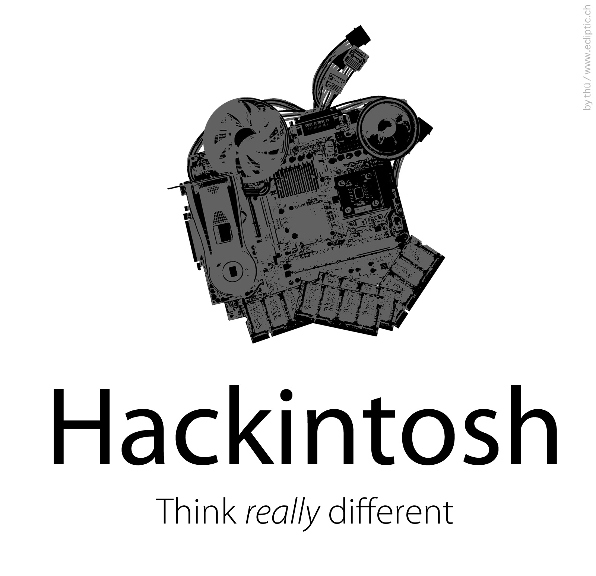
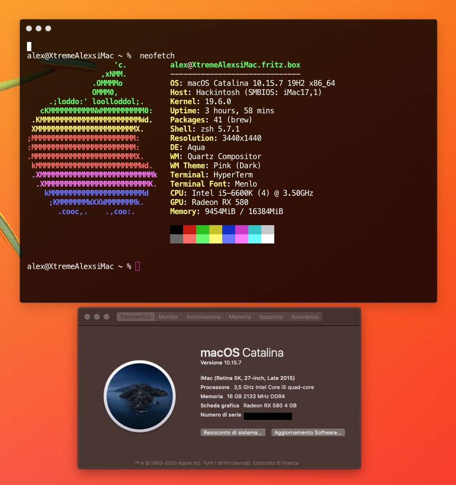
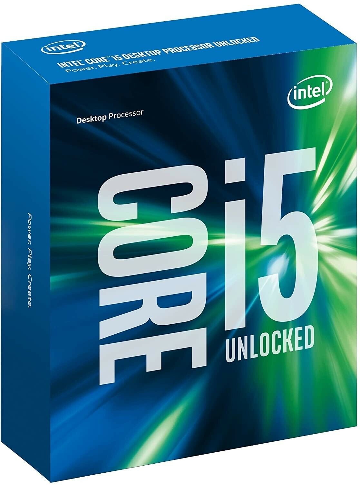
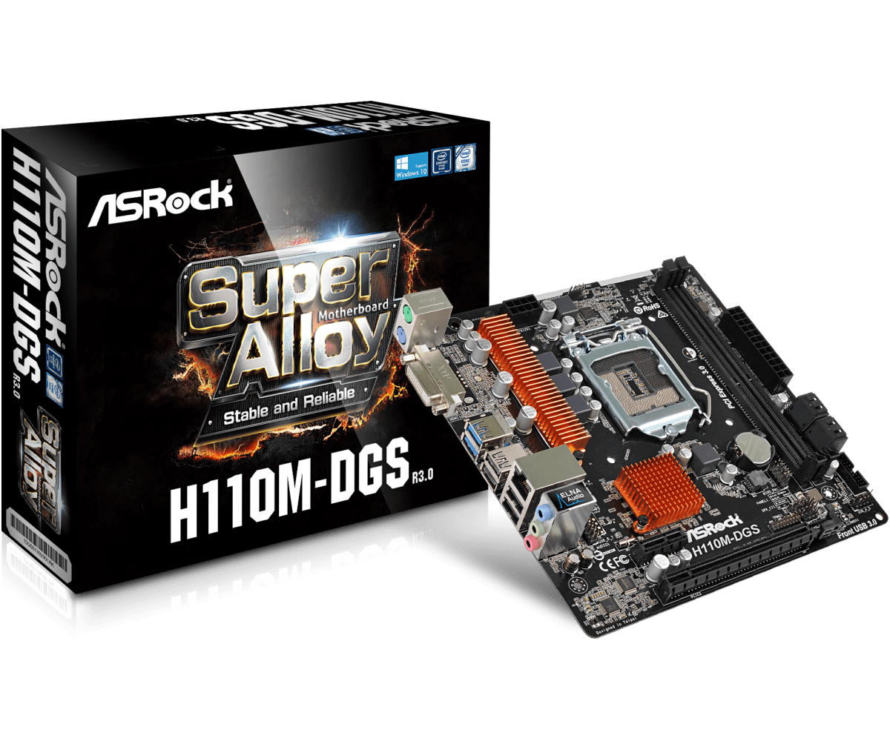
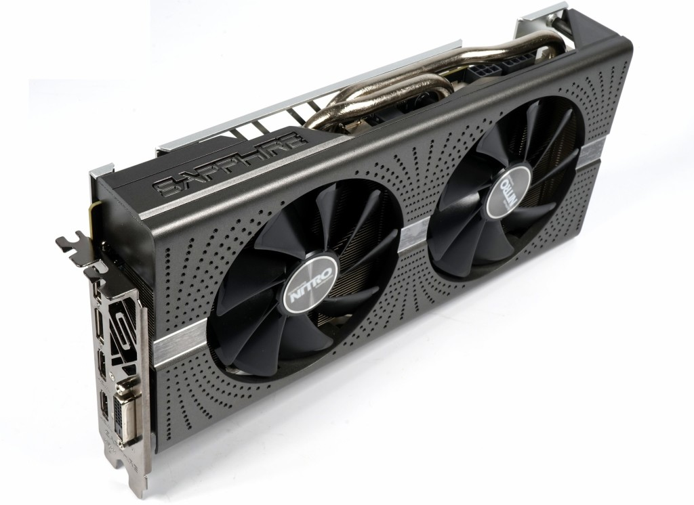
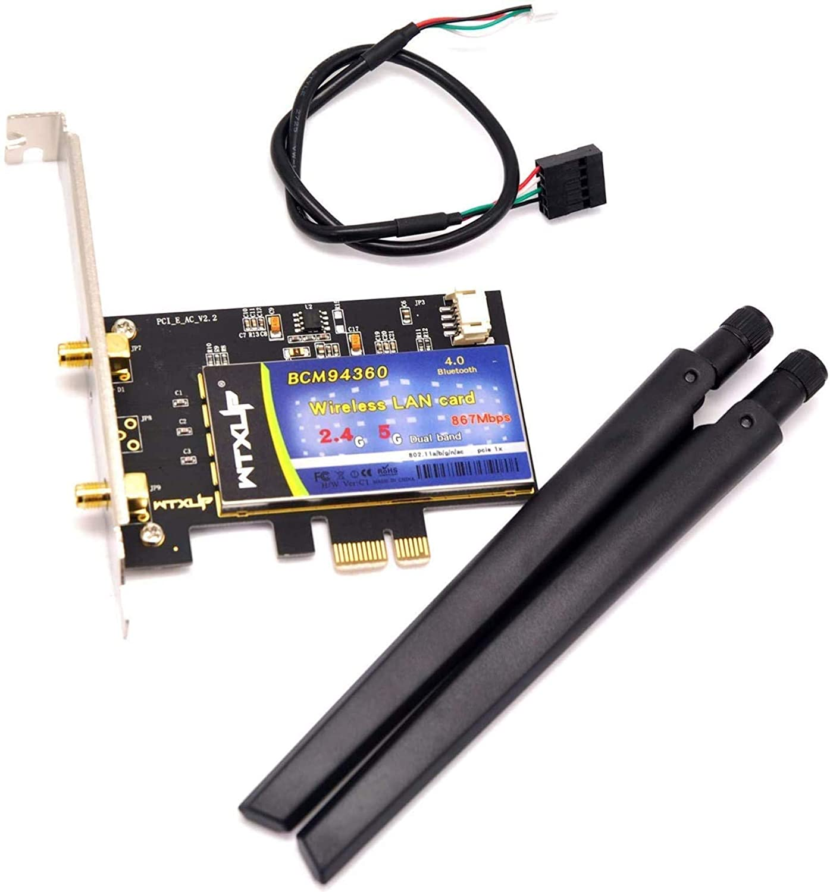

# Hackintosh macOS Catalina 10.15.7

## Specification
| **Component** | **Model** |
| ------------- | --------- |
| CPU | [Intel i5-6600K (4) @ 3.50GHz](https://ark.intel.com/content/www/it/it/ark/products/88191/intel-core-i5-6600k-processor-6m-cache-up-to-3-90-ghz.html) 

 |
| Motherboard | [Asrock H110M-DGS R3.0 LGA 1151](https://www.asrock.com/mb/Intel/H110M-DGS%20R3.0/index.it.asp) 

 |
| RAM | (1 x 16Bb) HyperX Fury HX432C16FB3A/16 Memoria DIMM DDR4 |
| Audio Chipset | ALC-887 |
| GPU | [Radeon RX 580](https://www.tomshw.it/hardware/test-radeon-rx-580-8gb) 

 |
| WiFi & Bluetooth | [MQUPIN - BCM94360CD](https://www.amazon.it/MQUPIN-BCM94360CD-Wireless-Bluetooth-Necessario/dp/B081CFM2J4) 

  |
| OS Disk | [Crucial MX500 500GB](https://it.crucial.com/ssd/mx500/ct500mx500ssd1) |
