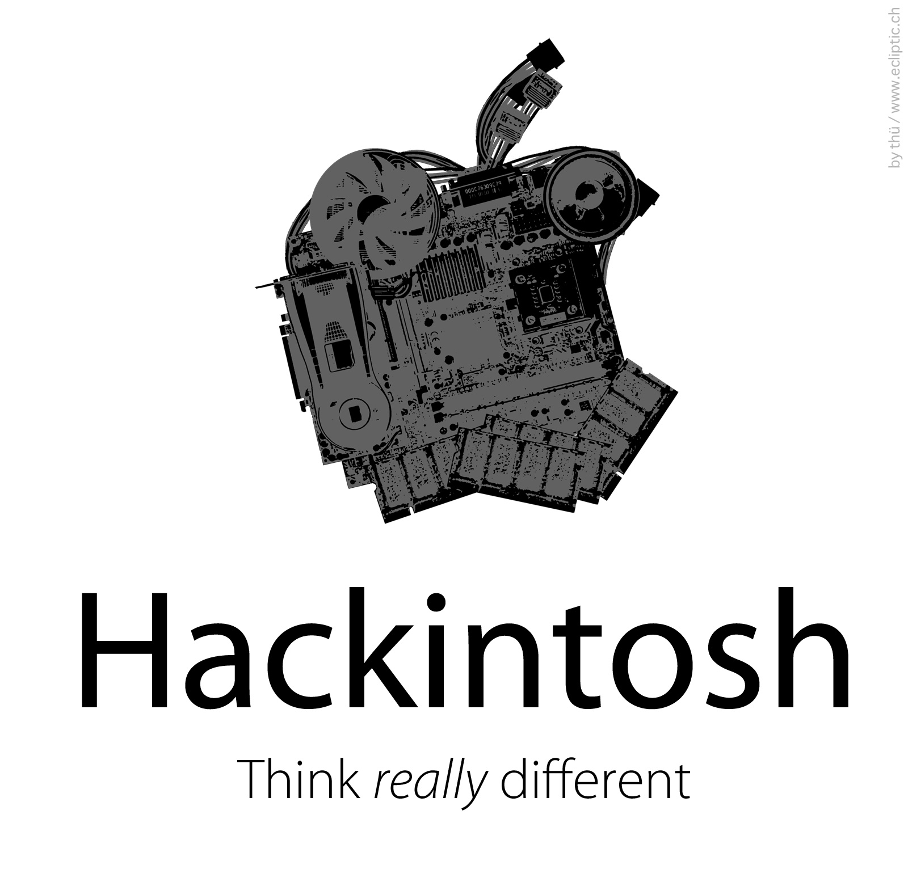
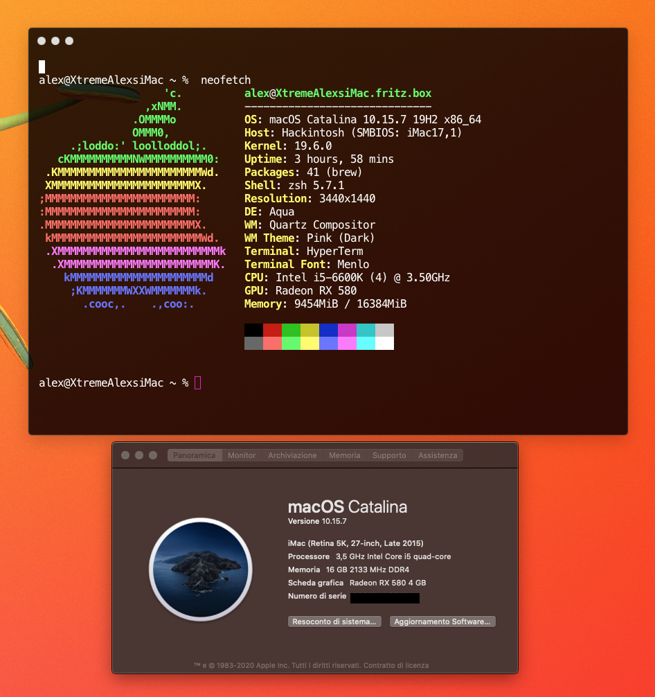
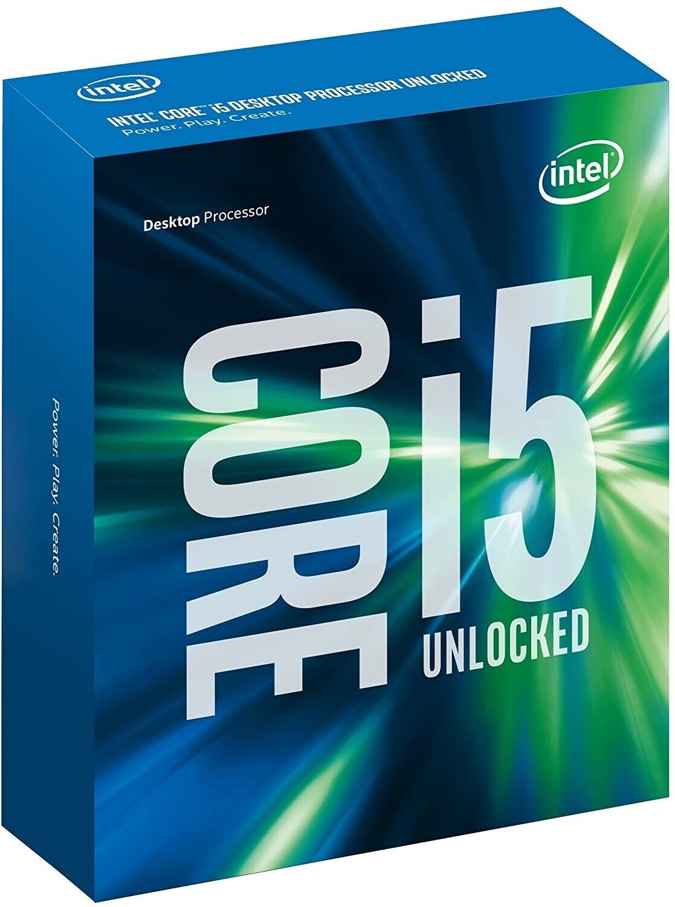
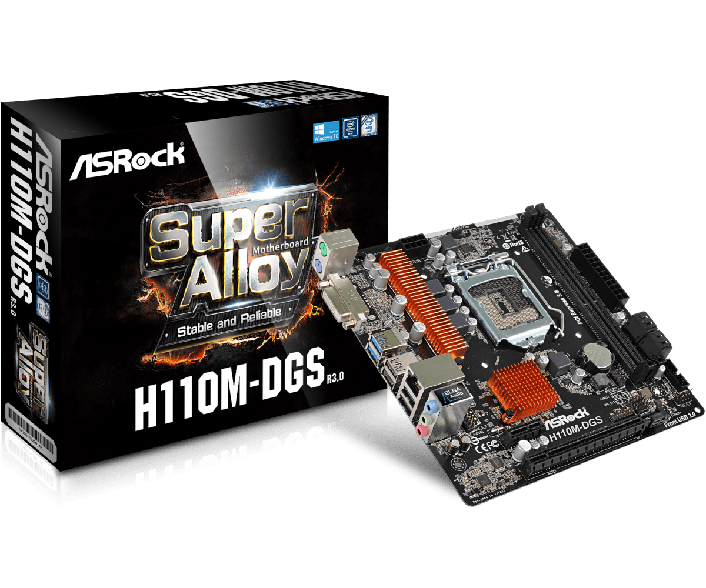
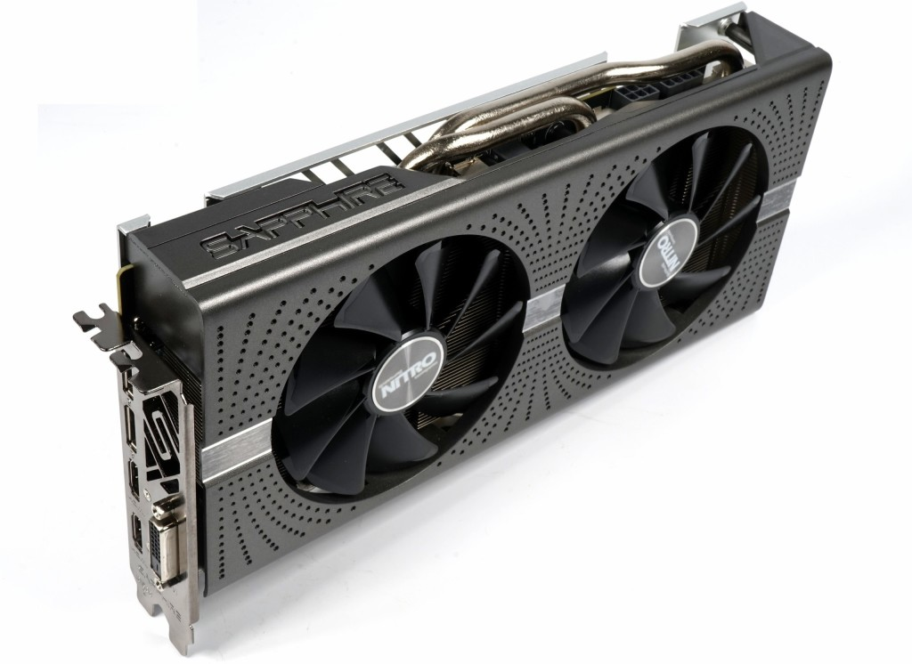
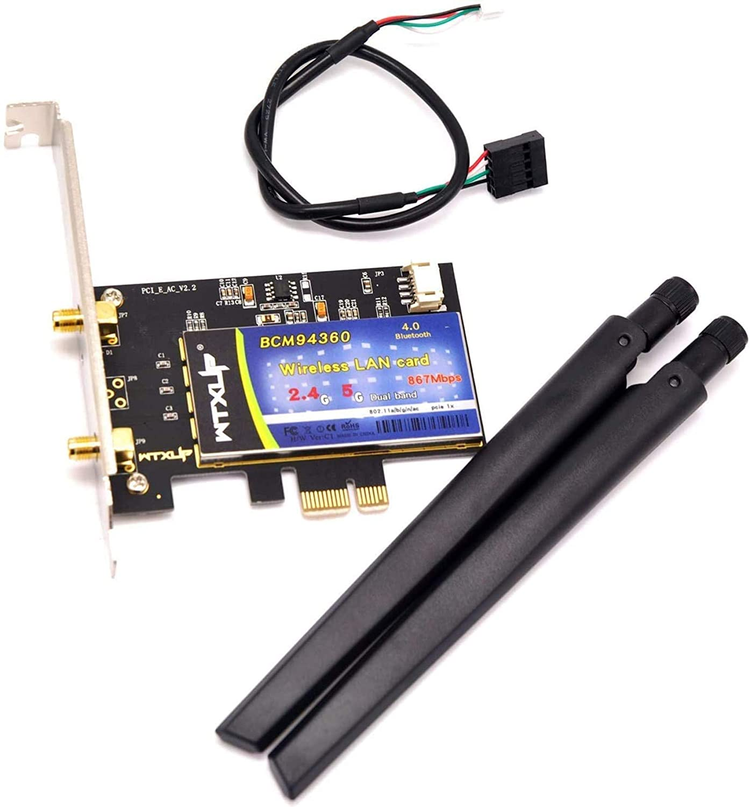

# Hackintosh con macOS Catalina 10.15.7

Il mio Hackintosh su piattaforma Intel Skylake, avviato con Clover. In questa
cartella trovi la EFI completa che usavo (`EFI/`): bootloader Clover, driver,
kext e SSDT, più la scheda dell'hardware qui sotto.

> Build storica, non più mantenuta. Prima di usare la EFI su un'altra macchina
> ricorda che `config.plist` contiene impostazioni specifiche per questo
> hardware; in `EFI/EFI/CLOVER/` ci sono anche `config_default.plist` e
> `config ok.plist`, versioni alternative della configurazione.

## Hardware

| Componente | Modello |
| ---------- | ------- |
| CPU | [Intel i5-6600K (4) @ 3.50GHz](https://ark.intel.com/content/www/it/it/ark/products/88191/intel-core-i5-6600k-processor-6m-cache-up-to-3-90-ghz.html) 

 |
| Scheda madre | [Asrock H110M-DGS R3.0 LGA 1151](https://www.asrock.com/mb/Intel/H110M-DGS%20R3.0/index.it.asp) 

 |
| RAM | 1 x 16 GB HyperX Fury HX432C16FB3A/16, DIMM DDR4 |
| Chipset audio | ALC-887 |
| GPU | [Radeon RX 580](https://www.tomshw.it/hardware/test-radeon-rx-580-8gb) 

 |
| Wi-Fi e Bluetooth | [MQUPIN - BCM94360CD](https://www.amazon.it/MQUPIN-BCM94360CD-Wireless-Bluetooth-Necessario/dp/B081CFM2J4) 

 |
| Disco di sistema | [Crucial MX500 500GB](https://it.crucial.com/ssd/mx500/ct500mx500ssd1) |
